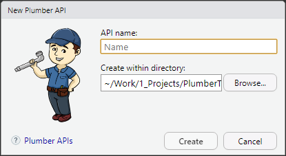
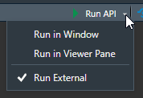
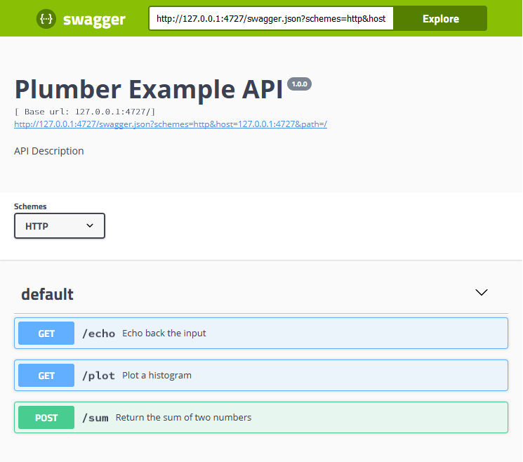
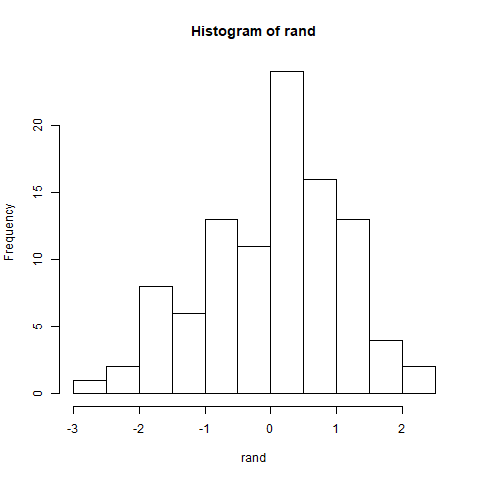

```{r setup, include=FALSE}
knitr::opts_chunk$set(echo = TRUE,
                      eval = FALSE,
                      include = TRUE,
                      warning = TRUE,
                      message = TRUE,
                      
                      cache = FALSE, # save chunks output 
                      
                      results = "hold", # display chunk output in one block
                      
                      tidy = FALSE, # better code organisation
                      tidy.opts = list(width.cutoff = 80),
                      strip.white = TRUE, #remove the white lines in the beginning or end of a source chunk
                      
                      fig.align = "center",
                      fig.width = 9,
                      fig.height = 5)

knitr::opts_knit$set(progress = TRUE,
                     verbose = FALSE,
                     width = 80)

```

```{css echo=FALSE, eval = TRUE}
/* add some CSS styling here */
h1 {
  margin-top: 30px;
}

h2 {
  margin-top: 20px;
}

code {
  color: #a21b1b;
  font-weight: bold;
}

.note {
  background-color: #f7f7f7;
  border-radius: 4px;
  padding: 4px 10px 4px 10px;
  margin-top: 25px;
}

/* horizontally centered image */
img {
  display: block;
  margin-left: auto;
  margin-right: auto;
  margin-bottom: 30px;
}

/* margin after code */
pre + p { /* select the first 'p' after 'pre')*/
  margin-top: 30px;
}
```


This document is a tutorial for the R package: plumber. A lot of examples and explanations come from [the official documentation](https://www.rplumber.io/docs/) and [this this article](https://rviews.rstudio.com/2018/07/23/rest-apis-and-plumber/) from R view.

I recommend using the "R-studio" IDE over the version 1.2 for this tutorial because it includes some `plumber` integration features.


<div class="note">
Note: For this tutorial, I deployed an example API accessible **from the UT-Biomet network** at the address: http://192.168.101.44:8080.

You can then get the results of the codes presented in this document without installing anything on your computer. For example, you can access from your web browser to this address to get a summary of all the API functions presented in this tutorial: http://192.168.101.44:8080/__swagger__/
</div>


# Introduction

The plumber R package (Trestle Technology, LLC 2017) allows users to expose existing R code as a service available to others on the Web through a "web API".

Web APIs created by plumber use the Hypertext Transfer Protocol ([HTTP](https://en.wikipedia.org/wiki/Hypertext_Transfer_Protocol)) to communicate information. This kind of application is called [RESTful API](https://en.wikipedia.org/wiki/Representational_state_transfer).

By this way, these APIs can be **accessed by any programming languages**, for example:

- R: `httr`, `RCurl` packages
- Python: `requests` library
- JavaScript: `Ajax` request
- Java: `HttpUrlConnection` class
- Julia: `HTTP` package
- And other...


## About HTTP Requests and responses

The API resources are accessible through HTTP requests. They are composed of several parts:

 - URL or path: the address where the request is sent
 - Method: the method invoked on the endpoint. It can be: `GET`, `POST`, `DELETE`, or `PUT`.
 - Headers: some meta-data sent to the server
 - Body: data sent to the server outside of the headers, (mainly for `POST` and `PUT` requests)

The different methods are for different usages:

- `GET`: is used to get a resource or collection of resources
- `POST`: is used to create a resource or collection of resources
- `DELETE`: is used to delete the existing resource or the collection of resources
- `PUT`: is used to update the existing resource or collection of resources


<div class="note">
For more information:

- **HTTP**: https://developer.mozilla.org/en-US/docs/Web/HTTP
</div>


# Installation

The latest stable version of `plumber` is hosted on CRAN and can be installed by the following command in R:

```{r install1}
install.packages("plumber")
```

The latest development version can also be installed from GitHub:
```{r install2}
library(devtools)
install_github("trestletech/plumber")
```


# First look on a `plumber` API

## Open a new `plumber.R` file
After installing the package **restart R-studio** and create a new `plumber.R` file :

**File >> New File >> Plumber API...**

Enter the API name and the path of the file in the following window: 



An R file named `plumber.R` (the conventional name for `plumber` APIs) containing an example API will open in RStudio.

https://support.rstudio.com/hc/en-us/articles/200526207-Using-Projects


<div class="note">
New `plumber` APIs can also be created within an **R project**:

**File >> New Project… >> New Directory >> Plumber API Project**

I highly recommend the use of "R projects" for **any R development** ! For more information: https://support.rstudio.com/hc/en-us/articles/200526207-Using-Projects
</div>


## `Plumber` API code structure

Let’s take a look at this example file:

The first part is just the file header and the package loading:
```{r apiStruct_header}
#
# This is a Plumber API. You can run the API by clicking
# the 'Run API' button above.
#
# Find out more about building APIs with Plumber here:
#
#    https://www.rplumber.io/
#

library(plumber)
```
<div style="margin-bottom:50px;">
</div>


Just after came the API description:
```{r apiStruct_desc}
#* @apiTitle Plumber Example API
```
- Here only the **API name** is set up using the syntax `#* @apiTitle` 

<div style="margin-bottom:50px;">
</div>


Finally came three **`Plumber` “endpoints.”** `echo`, `plot` and `sum`:
```{r apiStruct_fun} 
#* Echo back the input
#* @param msg The message to echo
#* @get /echo
function(msg = "") {
    list(msg = paste0("The message is: '", msg, "'"))
}

#* Plot a histogram
#* @png
#* @get /plot
function() {
    rand <- rnorm(100)
    hist(rand)
}

#* Return the sum of two numbers
#* @param a The first number to add
#* @param b The second number to add
#* @post /sum
function(a, b) {
    as.numeric(a) + as.numeric(b)
}
```
- These endpoints functions and preceded by a set of comments starting by `#*`. Theses annotation set up the API's endpoints.

<div style="margin-bottom:50px;">
</div>


## Run the example API

The API can be launched by clicking on the “Run API” button from R-Studio. I recommend using the “Run External” option to run the API in your default web browser.



Once the API is running you should see this page in your web browser:


This message should also appear in the `R` console: `Starting server to listen on port ????`, with `????` the port number where the API is connected (4727 in my case).

Congratulation the example API is now accessible on your local machine!

You can now make some request to this API. In your web browser go to the address (replacing XXXX by your port number):

- http://127.0.0.1:XXXX/echo 
- http://127.0.0.1:XXXX/plot 

The `/echo` endpoint should show output resembling:
```{json}
{"msg": ["The message is: ''"]}
```

The `/plot` endpoint should show output resembling:



<div class="note">
These endpoints can be accessed on the example API hosted in the lab at the following addresses:

- http://192.168.101.44:8080/__swagger__/
- http://192.168.101.44:8080/echo
- http://192.168.101.44:8080/plot
</div>


# Create our custom API

Let’s now create our own API!

## `plumber` syntax

Developing plumber API is simply a matter of providing specialized R comments before R functions. `plumber` recognizes both `#*` (or `#'` like the package `roxygen2`) comments. Some specific arguments specifying the API's setup can be written using `@`.

For example, the title of the API is specified by this line using the `@apiTitle` argument.

```{r plumber_syntax1}
#* @apiTitle Plumber Example API
```


## API description

First let's describe our API. The following is a list of some optional arguments that can be used for describing your API.

```{r plumber_syntax2}
##### API description #####

#* @apiTitle Plumber Example API
#* @apiDescription API example for the Plumber tutorial
#* @apiVersion 1.0.42
#* @apiTag default_example Endpoints of the default plumber.R example
#* @apiTag group1 Endpoints of the group 1
#* @apiTag group2 Endpoints of the group 2
#* @apiContact @email juliendiot@ut-biomet.org
```

- `@apiTitle`, `@apiDescription`, `@apiVersion`, and `@apiContact` are quite explicit.
- `@apiTag`: Allow to specify some groups for the API functions. The name of the group and its  description follow this parameter. A function can be assigned to a group with `@tag` followed by the group name. The endpoints will appear grouped in the "Swagger" page of the API.

## Endpoints, API functions returning a result.

Endpoints are the final step in the process of serving a request. An endpoint can simply be viewed as a function generating a response to a particular request.

Let’s create a very simple endpoint with no arguments returning the time and time zone of the API’s server.

```{r endpoint1}
#* Return the time of the API's server
#* @get /time
function(){
  list(time = Sys.time(),
       timezone = Sys.timezone())
}
```

The first line is the function description.

The second line specifies the method and the path to access this function. Here, the above function  run when a request with the `GET` method is sent at the path `/time` 

<div class="note">
See:

http://192.168.101.44:8080/time
</div>

## Function's arguments

Some arguments can be specified using the syntax `#* @param` followed by the argument name, and its description

```{r funArgs1}
#* Return square root of x
#* @param x a number
#* @get /sqrt
function(x){
  sqrt(as.numeric(x))
}
```

These parameters at specified with the syntax: `?param1=Value1&param2=value2...` at the end of the request's URL. 

<div class="note">
Notes: Arguments are passed to functions as character strings. The `as.numeric` function must be called to manage numbers.
</div>

It is also possible to set "Dynamic Routes". In these cases, the arguments are specified in the path:

```{r funArgs2}
#* Return a subset of Iris data according to the specie
#* @get /iris/<spec>
function(spec) {
  subset(iris, Species == spec)
}
```

<div class="note">
- http://192.168.101.44:8080/sqrt?x=9 (this endpoint will be improved in the [next section](#reqRes))
- http://192.168.101.44:8080/iris/setosa

</div>


### The `req` and `res` variables {#reqRes}

It is possible to access and modify the request and the response object in any functions of plumber directly. The function definition must specify `req` or `res` variables. For example, we can improve the `/sqrt` endpoint to return an error status if the request is not good (if x is not a positive number):

```{r req_res}
#* Return square root of x
#* @param x a number
#* @get /sqrt
function(x, res){
  if (missing(x)) {
    res$status <- 400 # Bad Request
    return(list(error = "x must be specified."))
  }

  x <- as.numeric(x)
  if (is.na(x) | x < 0) {
    res$status <- 400 # Bad Request
    return(list(error = "x must be positive number."))
  }

  sqrt(x)
}
```

<div class="note">

Note: See on the official documentation:

- https://www.rplumber.io/docs/routing-and-input.html#the-request-object
- https://www.rplumber.io/docs/rendering-and-output.html#response-object

for more information about these objects.

</div>

## Outputs

`plumber` must transform the objects returned by the R functions in another format the client can understand. It is called “serialization”. The default serializer is to the `JSON` (JavaScript Object Notation) format, but others can be used:

- `@json` (default)
- `@html`
- `@jpeg` the size and width can be specified using `(width = WW, height = HH)`
- `@png`
- `@serializer htmlwidget`: for objects from packages `plotly`, `DT`... 
- `@serializer unboxedJSON`: to return atomic value.

This parameter should be placed in the function's comments.

```{r output1}
#* JSON output
#* @tag outputs
#* @get /iris
#* @json
function(spec) {
  iris
}

#* HTML output
#* @tag outputs
#* @get /html
#* @html
function(){
  "<html><h1>Some HTML code:</h1><p>Hello world!</p></html>"
}

#* jpeg output
#* @tag outputs
#* @get /jpeg
#* @jpeg (width = 500, height = 500)
function(){
  curve(dnorm,-5,5)
}

#* png output
#* @tag outputs
#* @get /png
#* @png (width = 300, height = 300)
function(){
  curve(dnorm,-5,5)
}

#* plotly (htmlwidget) output
#* @tag outputs
#* @get /plotly
#* @serializer htmlwidget
function(){
  x <- seq(-5, 5, length.out = 500)
  d <- dnorm(x)

  plot_ly(
    type = 'scatter',
    mode = 'lines',
    name = paste("N(0;1)"),
    x = x,
    y = d,
    text = paste("f(X) =", round(d, 3),
                 "\nX =", round(x, 3)),
    hoverinfo = 'text'
  )
}

#* datatable (htmlwidget) output
#* @tag outputs
#* @get /datatable
#* @serializer htmlwidget
function(){
  datatable(iris)
}
```

The serializer above are the ones built into the package. However, other formats can be interesting  like "pdf", "XML"…

In these cases, you can leverage the `@serializer contentType` annotation. `plumber` doesn't serialize the response. It specifies the contentType header according to what is defined by `list(type="content/type")` (A list of some content types is available in the [appendix](#contentType)). For example:

```{r output2}
#* pdf output
#* @tag outputs
#* @get /pdf
#* @serializer contentType list(type="application/pdf")
function(){
  tmp <- tempfile()
  pdf(tmp)
  plot(1:10, type = "b")
  text(4, 8, "PDF from plumber!")
  text(6, 2, paste("The time is", Sys.time()))
  dev.off()

  readBin(tmp, "raw", n = file.info(tmp)$size)
}
```

It is also possible to write the content body directly:

```{r output3}
#* Endpoint that bypasses serialization
#* @tag outputs
#* @get /no_serialization
function(res){
  res$body <- "the content of the body"
  res
}
```


<div class="note">
See on the online API:

- http://192.168.101.44:8080/json
- http://192.168.101.44:8080/html
- http://192.168.101.44:8080/jpeg
- http://192.168.101.44:8080/png
- http://192.168.101.44:8080/plotly
- http://192.168.101.44:8080/datatable
- http://192.168.101.44:8080/pdf
- http://192.168.101.44:8080/xml
- http://192.168.101.44:8080/no_serialization

</div>


## Work with differents HTTP methods

As mention before, there are four HTTP methods usable in Rest API:

- `GET`: is used to get a resource or collection of resources
- `POST`: is used to create a resource or collection of resources
- `PUT`: is used to update the existing resource or collection of resources
- `DELETE`: is used to delete the existing resource or the collection of resources

Let's try to implement these methods by constructing a "messages board" (naive and straightforward) API where we can send and read messages.
This API should be able to:

- Add new messages to the board
- Return one or several messages to the client
- Modify messages
- Delete messages

The messages are stored in a simple `.txt` file on the server as a table. A message is composed of 5 parts:

- The name of the sender
- The message subject
- The message content
- An id
- The date and time of the message


### Add a new message

We want to create a new resource so we should use the `POST` method.

The client should specify 3 parameters for this request:

- `from`: who is the sender
- `subject`: the message subject
- `content`: the message content

The API will automatically create the ID and the time of the message.

```{r HTTP_POST}
#* Add a message to the "Public Messages Board"
#* @tag message_Board
#* @param from The sender
#* @param subject The message subject
#* @param content The message content
#* @post /messages
function(from, content, subject="no subject"){

  newMessage = data.frame(id = NA,
                          from = from,
                          subject = subject,
                          content = content,
                          time = as.character(Sys.time()))

  file <- "./data/messages.txt"

  if (file.exists(file)) {
    messages <- read.table(file,
                           header = T,
                           sep = '\t')

    newMessage$id <- max(messages$id) + 1
    write.table(newMessage, file, append = TRUE,
                sep = "\t",
                row.names = F,
                col.names = F)
    out <- "messages added !"
  } else {
    newMessage$id <- 1
    write.table(newMessage,
                file,
                sep = "\t",
                row.names = F,
                col.names = T)
    out <- "new file created, messages added !"
  }
  return(list(out = out,
              id = newMessage$id))
}
```

### Get some messages

We want to access to one or several messages so we should use the `GET` method:

Two endpoints are created one to get all the messages: `/messages` and another to filter the messages according to their id, sender or subject. 


```{r HTTP_GET}
#* Return all messages of the message board
#* @tag message_Board
#* @get /messages
function() {

  file <- "./data/messages.txt"
  if (file.exists(file)) {
    messages <- read.table(file,
                           header = T,
                           sep = '\t')
    return(messages)
  }
}

#* Return a subset of messages according to param
#* @tag message_Board
#* @get /messages/<param>
function(param) {

  file <- "./data/messages.txt"
  if (file.exists(file)) {
    messages <- read.table(file,
                           header = T,
                           sep = '\t')

    if (param %in% unique(messages$from)) {

      return(subset(messages, from == param))

    } else if (param %in% unique(messages$subject)) {

      return(subset(messages, subject == param))

    } else if (as.numeric(param) %in% messages$id) {

      return(messages[messages$id ==  as.numeric(param),])

    }
  }
}
```

### Edit an existing message

We want to access to modify a message so we should use the `PUT` method:

The request must provide the message's id to modify and the new values for the sender, the content, or the subject.

```{r HTTP_PUT}
#* Edit a message
#* @tag message_Board
#* @param id id of the message
#* @param from The sender
#* @param subject The message subject
#* @param content The message content
#* @put /messages
function(id, from=NULL, content=NULL, subject=NULL){
  id <- as.numeric(id)
  file <- "./data/messages.txt"

  if (file.exists(file)) {

    messages <- read.table(file,
                           header = T,
                           sep = '\t')

    if (id %in% messages$id) {

      if (!is.null(from)) {
        messages[messages$id == id,]$from <- from
      }
      if (!is.null(content)) {
        messages[messages$id == id,]$content <- content
      }
      if (!is.null(subject)) {
        messages[messages$id == id,]$subject <- subject
      }
      messages[messages$id == id,]$time <- as.character(Sys.time())

      write.table(messages,
                  file,
                  sep = "\t",
                  row.names = F,
                  col.names = T)
      return("Messages edited ! ")

    }
  }
}
```

### Delete a message

We want to delete a message so we should use the `DELETE` method. The deleted  message must be identified with its id.

```{r HTTP_DELETE}
#* Delete a message
#* @tag message_Board
#* @delete /messages/<id>
function(id){
  id <- as.numeric(id)
  file <- "./data/messages.txt"

  if (file.exists(file)) {

    messages <- read.table(file,
                           header = T,
                           sep = '\t')

    if (id %in% messages$id) {
      messages <- messages[messages$id != id,]

      write.table(messages,
                  file,
                  sep = "\t",
                  row.names = F,
                  col.names = T)
      return("Messages deleted ! ")

    }
  }
}
```

<div class="note">
See on the online API:

The `GET` request can be made in a web browser:

- http://192.168.101.44:8080/messages

The other requests can be made on the "Swagger" pages of the application:

- http://192.168.101.44:8080/__swagger__/

</div>


## Filters

Filters are plumber functions used to define a "pipeline" for handling incoming requests. Unlike endpoints, a request may go through multiple Plumber filters before a response is generated.

The request is passed through the filters in order of appearance in the code.
Filters can do one of three things in handling a request:

- Forward control onto the next handler, potentially after mutating the request.
- Return a response itself and not forward to subsequent handlers
- Throw an error

One common use case is to use a filter as a request logger:

```{r Filters}
#* Log some information about the incoming request
#* @filter logger
function(req){
  cat(as.character(Sys.time()), "-",
      req$REQUEST_METHOD, req$PATH_INFO, "-",
      req$HTTP_USER_AGENT, "@", req$REMOTE_ADDR, "\n")
  plumber::forward()
}
```


## Debbuging

In R, `print()` or `cat()` can be used to print out some state. For instance, `cat("i is currently: ", i)` could be inserted in your code to help you ensure that the variable `i` is what it should be at that point in your code.


This approach is equally viable with `plumber`. When developing your Plumber API in an interactive environment, this debugging output will be logged to the same terminal where you called `run()` on your API. In a non-interactive production environment, these messages will be included in the API server logs for later inspection.


Print debugging is an obvious starting point, but most developers eventually wish for something more powerful. In R, this capacity is built into the `browser()` function. If you’re unfamiliar, `browser()` pauses the execution of some function and gives you an interactive session in which you can inspect the current value of internal variables or even proceed through your function one statement at a time. (By the way, this function is also very beneficial for debugging `Shiny` applications or function called with an `apply` function).

You can leverage `browser()` when developing your APIs locally by adding a `browser()` call in one of your endpoints.

This is also an excellent way to get your hands dirty with Plumber and get better acquainted with how things behave at a low level. Consider the following API endpoint:

```{r Debbuging}
#* @get /
function(req, res){
  browser()
  list(a = 123)
}
```

If you run this API locally and then visit the API in a web browser, you’ll see your R session switch into debug mode when the request arrives, allowing you to look inside the `req` and `res` objects.

<div class="note">
Note: Of course, the `browser` function must not be present in any "in production" API, so the last endpoint is not in the deployed API of the lab.
</div>


# Access APIs from R

The package `httr` provide some tools to send HTTP requests to an online API. The functions `GET`, `POST`, `PUT`, `DELETE` call the corresponding methods:

```{r AccessR1}
library(httr)
resGET <- GET("http://192.168.101.44:8080/time")
print(resGET)
```
```{r AccessR1bis, eval=TRUE, echo=FALSE}
cat(" Response [http://192.168.101.44:8080/time]
   Date: 2019-08-21 08:14
   Status: 200
   Content-Type: application/json
   Size: 58 B")
```


```{r AccessR2}
print(content(resGET))
```
```{r AccessR2bis, eval=TRUE, echo=FALSE}
cat("$time
$time[[1]]
[1] \"2019-08-21 17:24:06\"


$timezone
$timezone[[1]]
[1] \"Asia/Tokyo\"")
```

Let's add a message on the "messages board" from R:

```{r AccessR3}
# messages specification
from <- "R"
subject <- "POST request"
content <- "I did a POST request from R !"

# write the url for the request
url <- paste0("http://192.168.101.44:8080/messages?from=", from,
              "&subject=", subject,
              "&content=", content )
url <- gsub(" ", "%20", url) # remove spaces

# send the request
resPOST <- POST(url)

# response visualisation
print(resPOST)
print(content(resPOST))
id <- unlist(content(resPOST)$id)
```

```{r AccessR3bis, eval=TRUE, echo=FALSE}
cat(" Response [http://192.168.101.44:8080/messages?from=R&subject=POST%20request&content=I%20did%20a%20POST%20request%20from%20R%20!]
   Date: 2019-08-21 08:01
   Status: 200
   Content-Type: application/json
   Size: 38 B
 
 $out
 $out[[1]]
 [1] \"messages added !\"
 
 
 $id
 $id[[1]]
 [1] 2")
```


The package `jsonlite` provides functions to manage the `JSON` format in R:

```{r AccessR4}
library(jsonlite)
url <- paste0("http://192.168.101.44:8080/messages/", id)
resGET <- GET(url)

print(resGET)
print(fromJSON(content(resGET, "text"), flatten = TRUE))
```

```{r AccessR4bis, eval=TRUE, echo=FALSE}
cat(" Response [http://192.168.101.44:8080/messages/2]
   Date: 2019-08-21 08:01
   Status: 200
   Content-Type: application/json
   Size: 118 B
 
   id from      subject                       content                time
 1 2    R POST request I did a POST request from R ! 2019-08-21 17:01:45")
```


```{r AccessR5}
DELETE(url)
```
```{r AccessR5bis, eval=TRUE, echo=FALSE}
cat(" Response [http://192.168.101.44:8080/messages/2]
   Date: 2019-08-21 08:01
   Status: 200
   Content-Type: application/json
   Size: 23 B")
```


<div class="note">
Note: The codes above do not truly generate the previous outputs when the `.rmd` file of this tutorial is rendered.

Indeed, the online API can render this report (see next section [The main advantage of `plumber`](#plumAdv)). However, a plumber API can't call them selfs because they use a single thread only. In order to avoid any bug, the results above had been implemented manually using the `cat` function in the `.rmd` file. These results are still the same than what you get when running the code in an interactive  `R` session.
</div>


# The main advantage of `plumber` {#plumAdv}

The main advantage of `plumber` is it allow to integrate all the power of the R language in an API. It is particularly interesting to provide features which would be challenging to implement in other languages.

For example, `plumber` API can quickly use statistical models developed in R. The following endpoint returns the result of a KNN prediction model determining the species of an iris flower from the petal and sepal width and length. The code generating the model is given in the [appendix](#knn).

```{r advantage1}
#* Predict species of Iris
#* @tag Rpower
#* @param SepalLength
#* @param SepalWidth
#* @param PetalLength
#* @param PetalWidth
#* @get /predictIris
function(SepalLength, SepalWidth, PetalLength, PetalWidth){

  irisKNNmodel <- readRDS("irisKNNmodel.rds")

  newdata <- data.frame(
    Sepal.Length = as.numeric(SepalLength),
    Sepal.Width = as.numeric(SepalWidth),
    Petal.Length = as.numeric(PetalLength),
    Petal.Width = as.numeric(PetalWidth)
  )
  as.character(predict(irisKNNmodel, newdata = newdata))
}
```

`R` provides useful packages that can also be integrated into an API. This endpoint generates an HTML document (this tutorial) from a Rmarkdown file:

```{r advantage2}
#* Run Rmarkdown to generate a plumber tutorial
#* @tag Rpower
#* @get /plumbertuto
#* @html
function(){
  file <- tempfile("PlumberTuto", fileext = ".html")
  render("./PlumberTuto.Rmd",
         output_file = file,
         envir = new.env(parent = globalenv()),
         encoding = "UTF-8")
  HTML <- paste(readLines(file), collapse = "\n")
  HTML
}
```
 
<div class="note">
See on the online API:

- http://192.168.101.44:8080/predictIris?SepalLength=5&SepalWidth=3&PetalLength=4&PetalWidth=1
- http://192.168.101.44:8080/plumbertuto


</div>

# Advanced features

The `plumber` package provides some more advanced features. These features will not be detailed in this tutorial, but resources can be found on the official documentation:

- Use of cookies to provides information about the user to the API: https://www.rplumber.io/docs/rendering-and-output.html#setting-cookies 
- Security of the API: (HTTPS, DoS attack...) https://www.rplumber.io/docs/security.html
- Hosting: Docker, systemd... https://www.rplumber.io/docs/hosting.html#systemd
- Error management: https://www.rplumber.io/docs/rendering-and-output.html#error-handling


# Sources and usful links

About plumber:

- Official website: https://www.rplumber.io/
- Official documentation: https://www.rplumber.io/docs/
- CRAN page: https://cran.r-project.org/web/packages/plumber/index.html
- Source code, GitHub page: https://github.com/trestletech/plumber
- Video tutorial by Jeff Allen from R-studio: https://www.rstudio.com/resources/videos/plumbing-apis-with-plumber/
- StackOverflow `plumber` tag: https://stackoverflow.com/questions/tagged/plumber
- Some blogs arcticles:

    - REST APIs and Plumber : https://rviews.rstudio.com/2018/07/23/rest-apis-and-plumber/
    - RStudio 1.2 Preview: Plumber Integration: https://blog.rstudio.com/2018/10/23/rstudio-1-2-preview-plumber-integration/
    - Are you leaking h2o? Call plumber! https://longhowlam.wordpress.com/2019/02/07/are-you-leaking-h2o-call-plumber/
    - Hosting a Plumber API on AWS https://datawookie.netlify.com/blog/2017/09/hosting-a-plumber-api-on-aws/

About HTTP:

- Mozilla Developer Network (MDN) doc:

    - HTTP: https://developer.mozilla.org/en-US/docs/Web/HTTP
    - HTTP methods: https://developer.mozilla.org/en-US/docs/Web/HTTP/Methods

About Rest API

- Mozilla Developer Network (MDN) doc: https://developer.mozilla.org/en-US/docs/Glossary/REST
- RESTful Tutorial: https://www.restapitutorial.com/


# Appendix


## Content-type {#contentType}

- html : `'text/html; charset : UTF-8'`
- htm : `'text/html; charset : UTF-8'`
- js : `'text/javascript'`
- css : `'text/css'`
- png : `'image/png'`
- jpg : `'image/jpeg'`
- jpeg : `'image/jpeg'`
- gif : `'image/gif'`
- svg : `'image/svg+xml'`
- txt : `'text/plain'`
- pdf : `'application/pdf'`
- ps : `'application/postscript'`
- xml : `'application/xml'`
- m3u : `'audio/x-mpegurl'`
- m4a : `'audio/mp4a-latm'`
- m4b : `'audio/mp4a-latm'`
- m4p : `'audio/mp4a-latm'`
- mp3 : `'audio/mpeg'`
- wav : `'audio/x-wav'`
- m4u : `'video/vnd.mpegurl'`
- m4v : `'video/x-m4v'`
- mp4 : `'video/mp4'`
- mpeg : `'video/mpeg'`
- mpg : `'video/mpeg'`
- avi : `'video/x-msvideo'`
- mov : `'video/quicktime'`
- ogg : `'application/ogg'`
- swf : `'application/x-shockwave-flash'`
- doc : `'application/msword'`
- xls : `'application/vnd.ms-excel'`
- ppt : `'application/vnd.ms-powerpoint'`
- xlsx : `'application/vnd.openxmlformats-officedocument.spreadsheetml.sheet'`
- xltx : `'application/vnd.openxmlformats-officedocument.spreadsheetml.template'`
- potx : `'application/vnd.openxmlformats-officedocument.presentationml.template'`
- ppsx : `'application/vnd.openxmlformats-officedocument.presentationml.slideshow'`
- pptx : `'application/vnd.openxmlformats-officedocument.presentationml.presentation'`
- sldx : `'application/vnd.openxmlformats-officedocument.presentationml.slide'`
- docx : `'application/vnd.openxmlformats-officedocument.wordprocessingml.document'`
- dotx : `'application/vnd.openxmlformats-officedocument.wordprocessingml.template'`
- xlam : `'application/vnd.ms-excel.addin.macroEnabled.12'`
- xlsb : `'application/vnd.ms-excel.sheet.binary.macroEnabled.12'`

## KNN on Iris data {#knn}

`R` code generating the KNN prediction model:

```{r KNN}
# Author: Julien Diot juliendiot@ut-biomet.org
# 2019 The University of Tokyo
#
# Description:
# A simple KNN model for the iris dataset.

#### PACKAGES ####
library(caret)


#### OPTIONS ####
# options(stringsAsFactors = FALSE)


#### CODE ####

# Import data
data(iris)


# train model
trControl <- trainControl(method = "boot",
                          number = 100)
method <- "knn"

(irisKNNmodel <- train(
  Species ~ .,
  data = iris,
  method = method,
  tuneGrid = data.frame(k = seq(1, 50, by = 2)),
  # tuneLength = 10,
  trControl = trControl))
ggplot(irisKNNmodel, metric = "Accuracy")

saveRDS(irisKNNmodel, file = "irisKNNmodel.rds")
```


 

<div style="margin-bottom:100px;">
</div>

```{r eval=TRUE}
print(sessionInfo(), locale = FALSE)
```
<div style="margin-bottom:100px;">
</div>
